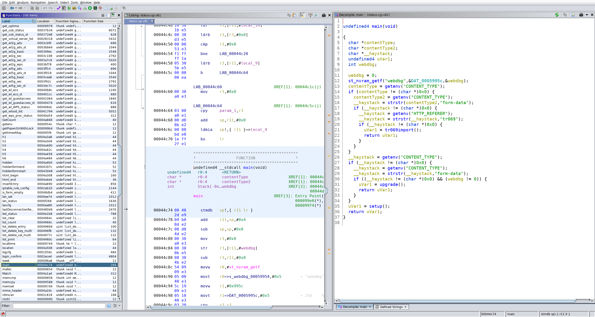
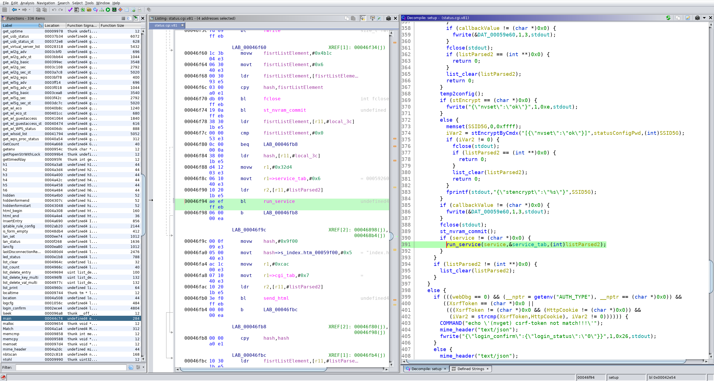
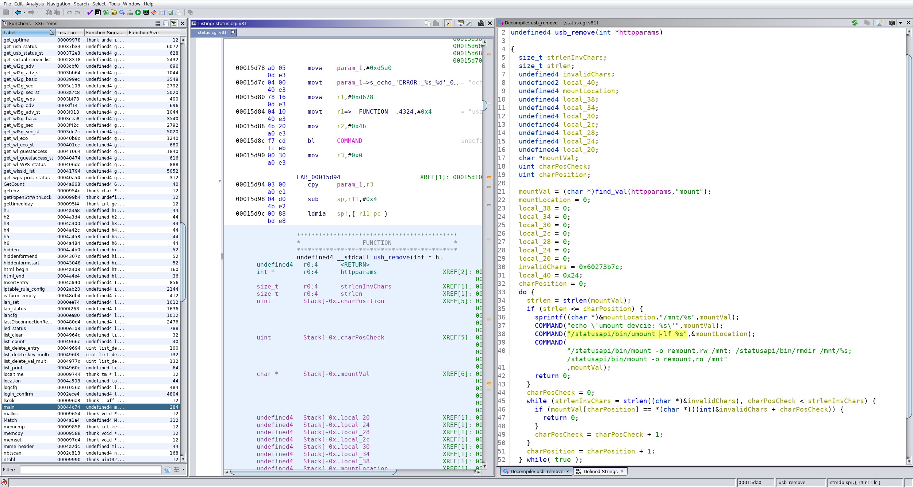
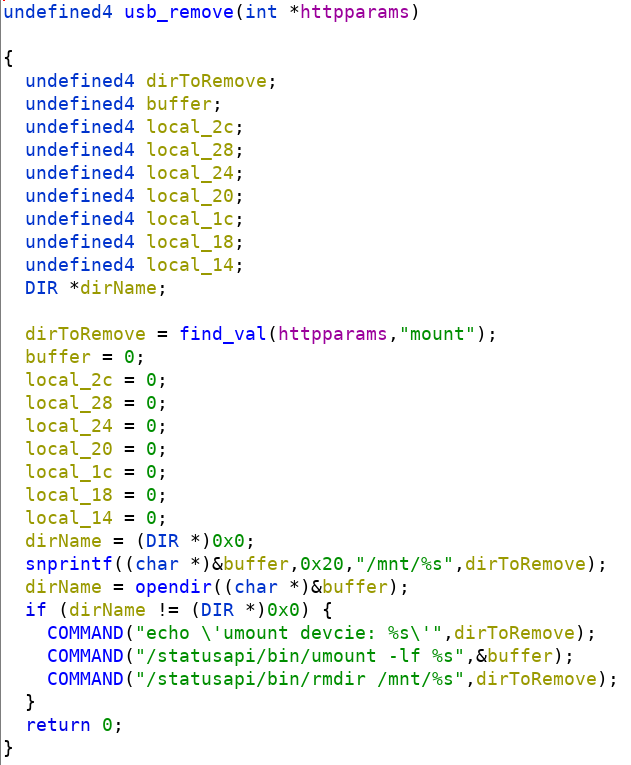

# Fastgate

All the firmware files are located in http://59.0.121.191:8080/ACS-server/file/FILENAME

Where FILENAME is equal to: 
* 0.00.89_FW_200_Askey
* 0.00.81_FW_200_Askey
* 0.00.67_FW_200_Askey
* 0.00.47_FW_200_Askey
* 0.00.267_FW_200_Askey
* 0.00.167_FW_200_Askey

So, for example, to obtain the last firware just go to http://59.0.121.191:8080/ACS-server/file/0.00.89_FW_200_Askey

To exctract the files we need the utility in https://github.com/nlitsme/ubidump (this is the first one that worked for me).

Doing a `binwalk` on the file gives us:

```console
$ binwalk 0.00.89_FW_200_Askey

DECIMAL       HEXADECIMAL     DESCRIPTION
--------------------------------------------------------------------------------
94            0x5E            JFFS2 filesystem, little endian
3276894       0x32005E        UBI erase count header, version: 1, EC: 0x0, VID header offset: 0x800, data offset: 0x1000
```

We don't need the JFFS2 filesystem, only the UBI part. To do that we can cut the file using `dd`.
To do that we need the total dimension and the UBI starting point.

The file dimension can be retrieved using ls:

```console
$ ls -la

total 55836
drwxr-xr-x  3 riccardo users     4096 set 24 10:07 .
drwx------ 83 riccardo users    12288 set 24 10:08 ..
-rw-r--r--  1 riccardo users 57147506 set 24 10:05 0.00.89_FW_200_Askey
```
The value ***57147506*** is what we need.
Looking at the output of `binwalk` we can see that the UBI part is starting at ***3276894***. With these two values we can use `dd` like this:

```console
$ dd if=0.00.89_FW_200_Askey of=0.00.89_FW_200_Askey.UBI bs=1 skip=3276894 count=57147506
```

Now we can use ubidump (after some initial configuration depending on the system config):

```console
$ git clone https://github.com/nlitsme/ubidump.git
$ sudo pip install crcmod
$ yay -S python-lzo
$ python ubidump/ubidump.py -s bump 0.00.89_FW_200_Askey.UBI
```

We now have the filesystem in `bump/rootfs_ubifs/`

Now we can proceed a bit further in the analysis.

Looking around in the filesystem we can see that the web gui is managed by mini_httpd:

```console
$ grep -i -r "mini_httpd"
etc/sniproxy/urlfilter3.sh:ln -sf /usr/sbin/mini_httpd $URLFILTER_WEBD_PATH 
etc/sniproxy/urlfilter3.sh:$URLFILTER_WEBD_PATH -d $URLFILTER_WEB_PATH -c "**.cgi" -u admin -S -E /web/mini_httpd.pem -p $webd_https_port 
bin/web.sh:#mv /tmp/mini_httpd /usr/sbin 
bin/web.sh:killall -9 mini_httpd 
bin/web.sh:mini_httpd -d /web -c "STATUSAPI/**.cgi|STATUSAPI/*" -u admin -T "UTF-8" -p 8080
```

And we can see that mini_httpd depends on a .cgi file:

```console
$ grep -i -r "status.cgi"
web/factory/mtcmd/mt_info.htm:          "url":"/status.cgi", 
web/fw-router/app/app.js:.value('apiServiceUrl', '/status.cgi') 
**web/js/status.js:var CGI_NAME='status.cgi';**
web/js/status.js:       "url":"http://192.168.101.93/STATUSAPI/status.cgi",
web/js/status.js:       "url":"http://192.168.101.93/STATUSAPI/status.cgi",
web/js/status.js:       "url":http://192.168.101.93/STATUSAPI/status.cgi,
```

So, using Ghidra, we can start looking in the `status.cgi`

Now I describe what's is really important, skipping a lot of details.

The first thing to look is for a main method like the one in this picture:



We can see that setup is called. After a bit of looking around run_service(...) seems the core of all the functionalities.



Looking for ***&service_tab*** we can see that some specific strings are linked to actual code executed by run_service(...)


After looking at these methods one by one I stubmle accross ***usb_remove***



In details:
```c
mountVal = (char *)find_val(httpparams,"mount");
```
Takes the string in the url request directly in a variable
```c
sprintf((char *)&mountLocation,"/mnt/%s",mountVal);
```
Create a complete path given the parameter in the URL request
```c
mountLocation
```
mountLocation is directly used in a command

Now, there are checks to prevent command injection. In particular:
```c
invalidChars = 0x60273b7c;
```
Is used to check for som einvalid characters like \` ' ; | but ***\&*** is not present in the list so if the parameter mount is equal to 
```console
&ping -c 10 192.168.1.172&
```
the check will result allow the execution of 
```console
/statusapi/bin/umount -lf &ping -c 10 192.168.1.172&
```
The mount command will fail but the following ping will be executed.

The patch published simplifies the code eliminating the checks for special characters by simply checking if the folder exists.



The code to exploit ths vulnerabilty and enable ssh is in fastwebEnableSSH.py https://github.com/garis/Fastgate/blob/master/fastwebEnableSSH.py
